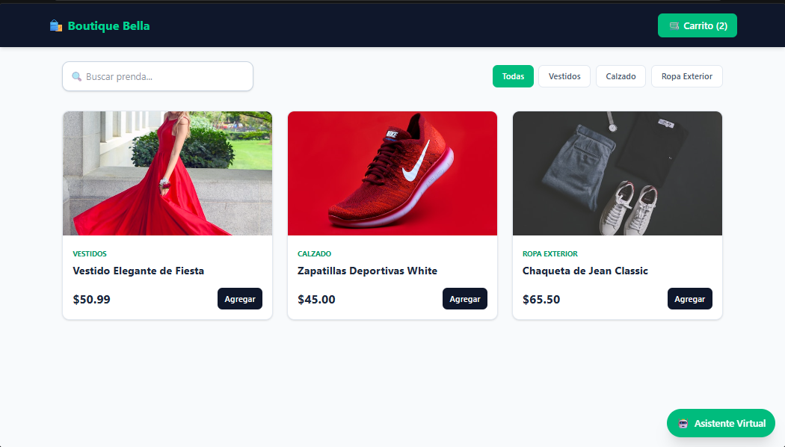
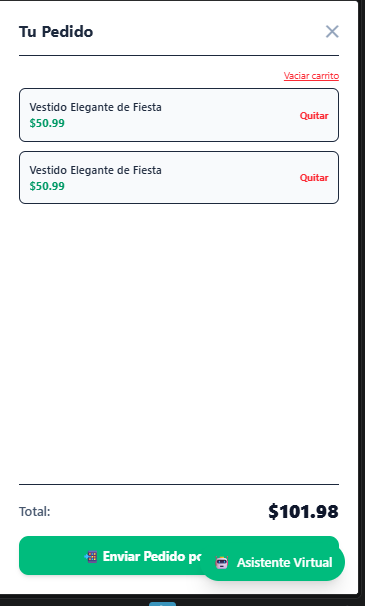
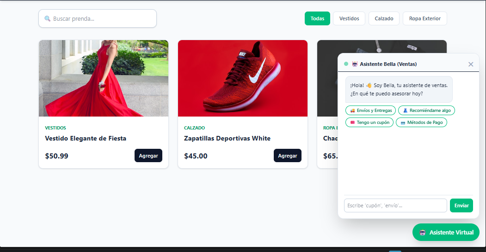
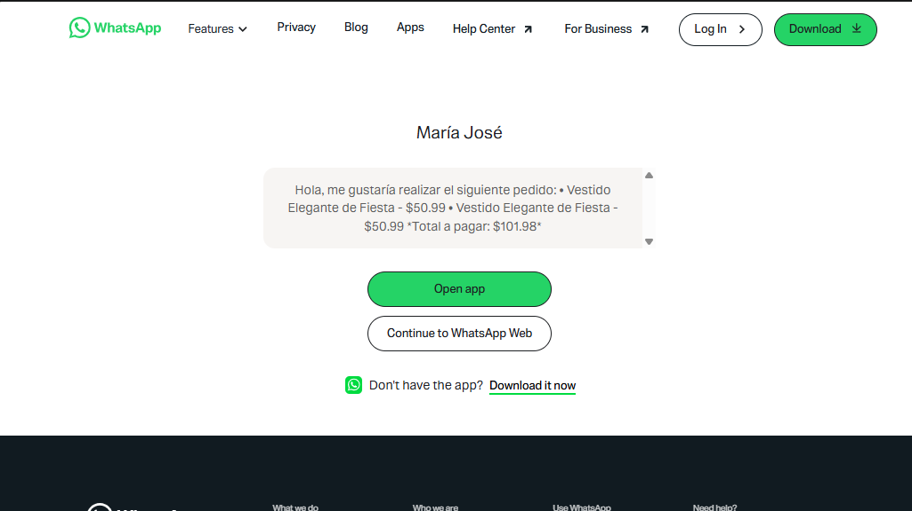

#  Boutique Bella - Tienda Demo (React + Vite)

¡Bienvenido/a a **Boutique Bella**! Una aplicación e-commerce interactiva desarrollada como proyecto de práctica para consolidar el desarrollo frontend con **React.js**, **Vite** y **Tailwind CSS**.

---

## Capturas de Pantalla

| Catálogo e Interfaz Principal | Carrito de Compras |
| :---: | :---: |
|  |  |

| Asistente Virtual de Ventas | Confirmación y Envío a WhatsApp |
| :---: | :---: |
|  |  |

---

##  Características Principales

- **Búsqueda y Filtrado en Tiempo Real:** Filtrado de productos por nombre mediante barra de búsqueda y clasificación dinámicas por categorías (*Vestidos, Calzado, Ropa Exterior*).
- **Gestión Avanzada del Carrito:**
  - Contador reactivo de productos en la barra superior.
  - Agregar prendas al pedido con cálculo automático del subtotal y total a pagar.
  - Vaciado completo o eliminación individual de ítems.
- **Asistente Virtual Interactivo (Chatbot):** Ventana emergente interactiva de soporte que resuelve dudas rápidas (métodos de pago, envíos, cupones y recomendaciones).
- **Integración con WhatsApp:** Envío automático del pedido formateado detallando los productos seleccionados y el precio total directo al canal de ventas por WhatsApp.

---

##  Tecnologías Utilizadas

- **React.js:** Librería principal para la interfaz de usuario.
- **Vite:** Empaquetador y entorno de desarrollo ultra rápido.
- **Tailwind CSS:** Framework de estilos CSS para un diseño limpio, moderno y responsivo.
- **React Hooks:** Manejo del estado y lógica del negocio (`useState`, `useEffect`).
- **Git & GitHub:** Control de versiones.

---

##  Instalación y Ejecución Local

Si deseas probar o ejecutar este proyecto localmente en tu equipo:

1. **Clonar el repositorio:**
   ```bash
   git clone [https://github.com/tu-usuario/nombre-de-tu-repo.git](https://github.com/tu-usuario/nombre-de-tu-repo.git)
   cd tienda-demo

